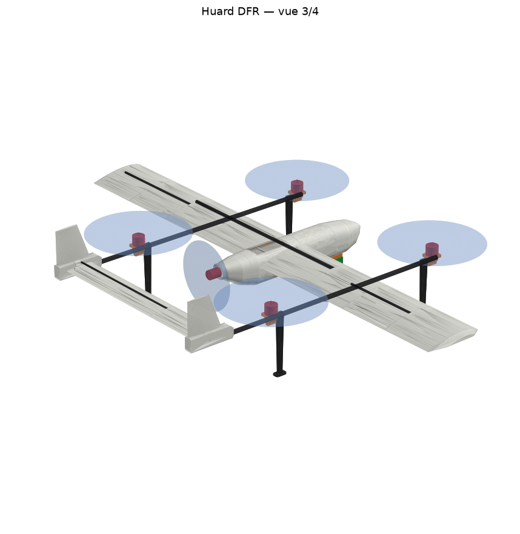
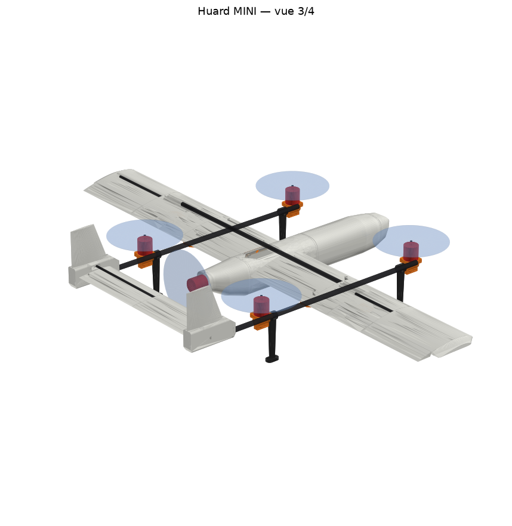

# Huard DFR : quadplane VTOL premier intervenant, imprimé en 3D

C'est un drone à décollage vertical de 1,8 m d'envergure, pensé pour être **le premier sur les lieux d'une intervention** (accident, recherche de personne, incendie). Il part seul d'une station, file à 80 km/h vers les coordonnées reçues, tourne au-dessus des lieux et transmet **en direct** l'image d'une caméra zoom et thermique aux policiers par le réseau cellulaire. Il revient ensuite se poser à la verticale.

Les pièces imprimées sont conçues pour une **Bambu Lab A1** (plateau 256 mm) et assemblées sur des tubes de carbone. Le concept complet (stations, logiciel, vidéo, réglementation, étapes) est dans [docs/concept_dfr.md](docs/concept_dfr.md).



| | |
|---|---|
| Envergure / corde | 1800 mm / 220 mm (aile rectangulaire, NACA 4412, calage 2,5°) |
| Longueur | ≈ 1050 mm |
| Masse au décollage | ≈ 4,8 kg |
| Propulsion VTOL | 4 × T-Motor MN4014 KV400, hélices P15×5, poussée/poids ≈ 2,2 (≈ 1,8 batterie affaissée) |
| Croisière | SunnySky X2820 V3 KV570 en pousseur, hélice APC 10×7EP |
| Batterie | GAONENG 6S3P Molicel P45B (13,5 Ah, 290 Wh, 1,34 kg) |
| Vitesses | transit 80 km/h, vol en cercle au-dessus des lieux ≈ 60 km/h |
| Charge utile | nacelle SIYI A8 mini (puis ZT6 thermique), Raspberry Pi 5, modem 4G Waveshare SIM7600G-H |
| Pilote automatique | ArduPilot sur TBS Lucid H7 Wing |

**Temps disponible au-dessus des lieux** (estimation, avec 30 % de réserve pour atterrir à la verticale avec une batterie encore vaillante : voir la simulation de vol) :

| Distance de l'intervention | 5 km | 10 km | 15 km | 20 km |
|---|---|---|---|---|
| Temps pour arriver | 4 min | 8 min | 11 min | 15 min |
| Temps sur place | ≈ 52 min | ≈ 39 min | ≈ 26 min | ≈ 13 min |

Le détail des calculs (masse, centrage, puissances) est dans [docs/bilan.md](docs/bilan.md). La **vérification d'intégration** (l'avion monté en 3D avec toutes les pièces achetées : collisions, débattements, hélices, garde au sol, chemins de câbles et de tubes) est dans [docs/verification.md](docs/verification.md) et [docs/verification_mini.md](docs/verification_mini.md). La **liste d'achats avec les modèles exacts et les liens** est dans [docs/nomenclature.md](docs/nomenclature.md) : le CAD est percé pour ces modèles.

## Deux versions : commencer petit

| | **Huard Mini** (pour apprendre) | **Huard DFR** (la mission) |
|---|---|---|
| Envergure | 1,2 m | 1,8 m |
| Masse au décollage | ≈ 1,9 kg | ≈ 4,9 kg |
| Batterie | LiPo 4S 4000 mAh | Li-ion 6S3P 13,5 Ah |
| Moteurs | 5 × Emax ECO III 2807 (pièces FPV) | 4 × T-Motor MN4014 + SunnySky X2820 |
| Caméra / 4G | non (caméra d'action en option) | SIYI A8 mini puis ZT6, Raspberry Pi, modem 4G |
| Autonomie estimée | ≈ 33 min | ≈ 65 min |
| Budget de l'avion | **≈ 670 $ CA** | ≈ 3 100 $ CA |
| Liste d'achats | [docs/nomenclature_mini.md](docs/nomenclature_mini.md) | [docs/nomenclature.md](docs/nomenclature.md) |
| Bilan | [docs/bilan_mini.md](docs/bilan_mini.md) | [docs/bilan.md](docs/bilan.md) |
| Paramètres ArduPilot | `ardupilot/huard_mini.param` | `ardupilot/huard_dfr.param` |
| Pièces à imprimer | `cad/out_mini/stl/` | `cad/out/stl/` |

Le Mini a exactement la même architecture : aile segmentée, poutres carbone, empennage en H, propulseur arrière, ArduPilot quadplane. Tout ce qu'on apprend dessus (impression, collage, réglages, transitions, missions automatiques) s'applique au grand. Les réglages d'impression et l'ordre d'assemblage plus bas valent pour les deux.



## Contenu

```
cad/params_dfr.py       toutes les cotes du DFR (changer une valeur et régénérer)
cad/params_mini.py      toutes les cotes du Mini
cad/pieces.py           géométrie de chaque pièce (CadQuery)
cad/build.py            génère STL, STEP, masses, centre de gravité et rendus
cad/verification.py     monte l'avion complet en 3D et vérifie que tout rentre et que tout bouge
cad/out/stl/            pièces prêtes à trancher, déjà orientées pour l'impression
cad/out/step/           pièces dans le repère avion, pour modifier dans Fusion ou Onshape
cad/out/assemblage.glb  avion complet en 3D
calc/dimensionnement.py bilan de masse, centrage, poussée, autonomie, rayon d'action
calc/essais_virtuels.py  pression, charges de vol, résistance, stabilité, servos
simulation/              modèle de vol et vols simulés dans ArduPilot (SITL)
ardupilot/huard_*.param  paramètres ArduPlane 4.7 (DFR : TBS Lucid H7 Wing ; Mini : AtomRC F405 NAVI)
docs/                   concept du système, nomenclature, bilan
```

### Régénérer les pièces

```bash
pip install cadquery trimesh shapely matplotlib networkx
cd cad && python build.py                        # Huard DFR  -> cad/out/
HUARD_VERSION=mini python build.py               # Huard Mini -> cad/out_mini/
cd .. && python calc/dimensionnement.py          # bilan DFR  -> docs/bilan.md
HUARD_VERSION=mini python calc/dimensionnement.py  # bilan Mini -> docs/bilan_mini.md
# Sous Windows (PowerShell) : $env:HUARD_VERSION="mini"; python build.py
```

## Configuration

```
              vue de dessus (nez vers la droite)
   bloc de queue    M2 ●────────────────────────────● M3   (arrière / avant gauche)
   + dérive            ║        ┌──────────────┐    ║
   stab + profondeur   ║  ◐ ═══ │   fuselage   │ ═══════   ← aile 1,8 m
   (empennage en H)    ║ pousseur└──────────────┘    ║
                    M4 ●────────────────────────────● M1   (arrière / avant droit)
                                       ▼ nacelle caméra sous l'avant du fuselage
```

- **Deux poutres carbone** à ±360 mm sous l'aile, tenues par des pylônes vissés. Elles portent les 4 moteurs VTOL (±365 mm autour du centre de gravité, hélices de 15 po) et l'empennage en H au bout.
- **Le fuselage** est en 4 tronçons. Le nez est amovible pour glisser la batterie sur le plateau avant. Le contrôleur de vol, le Raspberry Pi et le modem 4G sont sur un second plateau dans le tronçon du milieu. Le moteur propulsif est boulonné sur une cloison en PETG au bout de la queue.
- **La nacelle caméra** est fixée sous l'avant du fuselage, sur une selle en PETG vissée à travers le plateau. Elle voit vers l'avant et vers le bas sans être gênée par les hélices.
- **L'aile** est en 2 demi-ailes de 4 segments chacune, enfilées sur un longeron de 16 mm qui traverse le fuselage. Un longeron de 8 mm prend le relais vers les bouts d'aile et une goupille de 6 mm fixe l'incidence.
- **Le centre de gravité** visé est à 62 mm du bord d'attaque (28 % de corde), au milieu des 4 moteurs VTOL. Avec la batterie GAONENG, il tombe en place quand **le centre de la batterie est à 116 mm devant le bord d'attaque**, c'est-à-dire batterie poussée presque au bout du plateau, sans lest (voir docs/bilan.md).

## Vérification d'intégration

`cad/verification.py` monte l'avion complet en 3D, avec chaque pièce imprimée et chaque pièce achetée à ses cotes. Il vérifie ensuite :
- aucune collision ;
- ailerons et profondeur braqués à ±25° sans toucher ;
- hélices libres ;
- garde au sol ;
- conduit de câbles continu de l'aile jusqu'au fuselage ;
- poutres et longerons qui passent dans leurs fourreaux ;
- tubes à couper dans des tubes de 1 m ;
- toutes les pièces sur le plateau de la A1.
- toutes les pièces s'impriment sans supports : chaque pièce est tranchée couche par couche, comme dans Bambu Studio, et aucune couche ne doit partir dans le vide (pas de fine bande ni de plafond suspendu).

**Résultat actuel : tout est bon sur les deux versions** ([DFR](docs/verification.md), [Mini](docs/verification_mini.md)). À relancer après toute modification des paramètres :

```bash
cd cad && python verification.py && HUARD_VERSION=mini python verification.py
```

Ordre de montage conseillé pour valider avant de tout imprimer : un segment d'aile, un support moteur avec sa platine, un cadre de servo avec sa trappe. On vérifie l'ajustement sur les vraies pièces achetées, et seulement ensuite on lance le reste.

## Essais virtuels : pression, charges de vol, résistance, stabilité

`calc/essais_virtuels.py` fait les calculs d'ingénieur d'un avion léger sur les cotes réelles du modèle :
pression de l'air sur le profil (méthode des panneaux), facteurs de charge en manœuvre et en rafale,
flexion et torsion de l'aile, peau entre les âmes, stabilité (point neutre, marge statique), braquage de
profondeur pour équilibrer, couple des servos, poutres plein gaz, vibrations, atterrissage dur.
Rapports : [DFR](docs/essais_virtuels.md), [Mini](docs/essais_virtuels_mini.md).

Ce que ces essais ont fait corriger :
- **DFR : le longeron principal passe de 12 à 16 mm.** Le 12 mm aurait travaillé au-delà de sa résistance à la charge extrême (6,4 g).
- **Peau de l'aile : plus d'âmes près de l'emplanture** (DFR 20/14/10/6 diagonales du centre vers le bout, Mini 12/8/5). Avant, la peau du dessus, trop large entre deux âmes, aurait ondulé dès un virage serré.

```bash
python calc/essais_virtuels.py && HUARD_VERSION=mini python calc/essais_virtuels.py
```

## Vols simulés dans ArduPilot

`simulation/` fait voler l'avion dans le **vrai logiciel ArduPilot** (ArduPlane 4.7.1 compilé pour ordinateur,
« SITL »). Le modèle de vol est calculé à partir des cotes réelles par `simulation/modele_sitl.py` :
- masse et inerties de chaque pièce ;
- aérodynamique et stabilité ;
- poussée des moteurs, qui suit la tension de la batterie ;
- hélice propulsive dont la poussée baisse avec la vitesse ;
- résistance interne de la batterie.

Les paramètres utilisés sont ceux de `ardupilot/huard_*.param`. Cinq scénarios sont testés :
- mission complète sans vent ;
- vent de 25 km/h avec rafales ;
- vent de 32 km/h avec rafales fortes (test de limite) ;
- perte de la radio en croisière ;
- batterie presque vide en pleine mission.

Rapports : [DFR](docs/simulation.md), [Mini](docs/simulation_mini.md).

Ce que la simulation a fait corriger dans les paramètres :
- **Noms ArduPlane 4.7** : `ARMING_CHECK` devient `ARMING_SKIPCHK`, et `Q_ANGLE_MAX` devient `Q_A_ANGLE_MAX`.
- **Mini, aide des moteurs VTOL** : son seuil était égal à la vitesse mini de vol (`Q_ASSIST_SPEED` = `AIRSPEED_MIN`), donc les moteurs VTOL se rallumaient à chaque montée. Maintenant 12 m/s pour l'aide, 14 m/s pour la vitesse mini.
- **`Q_ASSIST_ALT 20`** : si une rafale fait décrocher l'avion, les moteurs VTOL le rattrapent sous 20 m. Sans ce réglage, le Mini touchait le sol dans les rafales fortes.
- **`BATT_FS_VOLTSRC 1`** : les alarmes de batterie se basent sur la tension au repos estimée. Sinon, la chute de tension sous la charge du stationnaire déclenchait une fausse alarme au décollage.
- **DFR, 30 % de réserve de batterie** : en fin de pack Li-ion, les moteurs VTOL n'ont plus assez de marge pour atterrir.
- **DFR, croisière à 79 km/h** (`AIRSPEED_CRUISE 22`) : avec l'hélice 10×7, le propulseur ne tenait ni 90 km/h ni l'altitude. Bonus : il consomme moins, et le temps sur les lieux augmente.
- **Gaz de stationnaire réalistes** (`Q_M_THST_HOVER`) et **vitesse de croisière du Mini**, fixée par `TRIM_THROTTLE` puisqu'il n'a pas de capteur de vitesse.

Pour relancer (une fois ArduPilot compilé avec `simulation/sitl_poussee.patch`, voir l'en-tête de `simulation/vol_simule.py`) :

```bash
HUARD_VERSION=mini python simulation/vol_simule.py && python simulation/vol_simule.py
```

## Avant d'imprimer l'avion : le kit d'essai (≈ 15 g de PLA Aero, ≈ 50 g de PETG)

Fichiers dans `cad/out_mini/essais/` (Mini) et `cad/out/essais/` (DFR), à régénérer avec `python outils_essais.py`. La moitié du kit, ce sont de vraies pièces de l'avion : rien n'est perdu.

| Fichier | Filament | Ce qu'on vérifie | Si ça ne va pas |
|---|---|---|---|
| `1_jauge_tubes` | PETG, 3 parois, 15 % | Pour chaque tube carbone : trou « − » (jeu 0,1 mm), trou marqué du diamètre (jeu 0,3 mm, celui du modèle), trou « + » (0,5 mm). Le bon trou laisse glisser le tube **à la main, sans jeu qui ballotte** | Si c'est le « − » ou le « + » qui va, dis-le-moi : je change `JEU_TUBE` et tout se régénère |
| `2_tranche_aile` | PLA Aero | Peau lisse et fermée, âmes collées aux peaux, tubes qui entrent dans les fourreaux. **Pèse-la** | Peau trouée ou molle : ajuster débit et température du PLA Aero. Plus lourde que prévu : idem (le poids attendu s'affiche quand on lance le script) |
| `3_jonction_cote_avant` + `3_jonction_cote_milieu` | PLA Aero | Les deux tranches s'emboîtent par la lèvre, **à la main, sans forcer**, sans jeu visible | Trop serré ou trop lâche : je change le jeu de la lèvre |
| `4_support_moteur` + `4_platine_moteur` | PETG | Le collier serre le tube avec ses 2 vis ; le moteur se visse sur la platine ; les têtes de vis tombent dans les creux de la bride ; les 4 vis de coin s'atteignent par-dessous | Envoie une photo |
| `5_cadre_servo_aile` + `5_trappe_servo_aile` | PETG | Ton servo s'emboîte, ses oreilles entrent dans les encoches, la trappe se visse et le palonnier passe par la fente | Mesure le servo (longueur, épaisseur, oreilles) et envoie les chiffres |
| `6_guignol_aileron` | PETG | Plaque nette, trous de 1,6 mm ouverts | — |

**Quand tout le kit est bon, tu imprimes l'avion en confiance.** Ordre conseillé ensuite : un segment d'aile complet (le peser), puis le reste de l'aile, l'empennage, le fuselage, et les pattes en TPU en dernier.

## Impression (Bambu Studio)

Les STL de `cad/out/stl/` sont déjà dans la bonne orientation et s'impriment sans supports : les segments d'aile et de stab sont debout sur leur face d'emplanture, les tronçons de fuselage debout (le nez pointe en haut) et les pattes debout sur leur pied.

| Pièces | Filament | Réglages |
|---|---|---|
| `aile_segment_*`, `stab_segment_*` | PLA Aero | **1 paroi, 0 % de remplissage, 0 couche dessus/dessous**, détection des parois fines activée. Les parois, âmes et fourreaux sont déjà modélisés. Exception : le segment qui porte la baie du servo d'aileron (segment 3 du DFR, segment 2 du Mini) avec 2 couches dessus/dessous pour fermer la baie. |
| `aileron_*`, `profondeur_*` | PLA Aero | **2 parois** (peau de 0,8 mm), 0 % de remplissage, **3 couches dessus/dessous** pour fermer les bouts |
| `guignol_aileron` (×2), `guignol_profondeur` | PETG | À plat, 100 % de remplissage : petites pièces qui travaillent |
| `cadre_servo_aile_*`, `trappe_servo_aile_*` | PETG | Cadre : 3 parois, 30 %. Trappe : 100 %. Les deux reposent à plat sur le plateau |
| `fuselage_avant`, `fuselage_milieu`, `fuselage_queue` | PLA Aero | 1 paroi, 0 % de remplissage, 0 couche dessus/dessous |
| `fuselage_nez` | PLA Aero | 1 paroi, 0 % de remplissage, **3 couches dessus** (la pointe est fermée) |
| `saumon_*`, `bloc_queue_*` | PLA Aero | 3 parois, 8 % gyroïde |
| `pylone_poutre_*` | PETG | 4 parois (pour les inserts), 15 % gyroïde, bordure de 5 mm |
| `support_moteur` (×4) | PETG | 4 parois, 40 % gyroïde |
| `cloison_moteur`, `support_nacelle` | PETG | 4 parois, 50 % |
| `plateau_electronique`, `plateau_compagnon` | PETG | 3 parois, 30 % |
| `trappe_acces` | PETG | Debout sur son bout avant (déjà orientée), **bordure de 5 mm**, 3 parois, 30 % |
| `entretoise_plateau_*` (DFR) | PETG | 100 %, petites pièces |
| `patte_atterrissage` (×4) | TPU 95A | 3 parois, 25 %, vitesse lente |

Conseils pour la A1 : son plateau bouge d'avant en arrière, donc place les pièces hautes et minces (segments d'aile) avec la corde dans l'axe avant-arrière. Ajoute une bordure (brim) de 5 mm et ralentis les parois extérieures à environ 150 mm/s. Imprime d'abord **un seul segment d'aile** pour valider le profil PLA Aero (température, moussage, masse ≈ 60 g).

Masse estimée de chaque pièce : `cad/out/masses.csv`. Pèse tes pièces : si elles sont nettement plus lourdes, ajuste le débit du PLA Aero avant d'imprimer le reste.

## Assemblage, dans l'ordre

1. **Aile** : coller les segments de chaque côté à la CA en les enfilant sur le longeron pour l'alignement. Coller le saumon au bout du segment extérieur (il couvre la partie fixe ; l’aileron va jusqu’au bout de l’aile, avec 1 mm de jeu contre le saumon).
   - **Ailerons** : enfiler les deux morceaux d'aileron sur le jonc carbone de 2 mm, glisser le **guignol PETG** par-dessous dans sa fente (le jonc passe dans son trou), puis coller le tout à la CA. Poser l'aileron avec une **charnière en ruban sur le dessus** (extrados), en laissant le V ouvert dessous : c'est ce V qui permet à l'aileron de monter de plus de 25°.
   - **Servo d'aileron** (coupe : [DFR](docs/images/coupe_servo_aileron_dfr.png), [Mini](docs/images/coupe_servo_aileron_mini.png)) :
     1. Coller le **cadre de servo** à l'époxy dans la baie ouverte sous l'aile, contre la peau du dessus. Il ne bouge plus.
     2. Centrer le servo (palonnier enlevé) avec la radio, puis l'emboîter dans le cadre, couché, axe vers le saumon : ses **oreilles s'engagent dans les encoches** du cadre, ce qui l'empêche de glisser. Pas de colle sur le servo.
     3. Brancher une **rallonge de servo** (50 cm DFR, 30 cm Mini) et la passer dans le **conduit de câbles** : un tunnel continu dans l'aile, du servo jusqu'au trou du flanc du fuselage. Le plus simple est d'enfiler un fil de fer avant de coller les segments, puis de tirer les câbles avec.
     4. Visser la **trappe** par-dessous avec **2 vis M2 × 6** (autotaraudeuses, dans les avant-trous du cadre). Elle tient le servo prisonnier.
     5. Remettre le palonnier à travers la fente de la trappe, et relier son trou **à 10 mm de l'axe (DFR) ou 8 mm (Mini)** au trou intérieur du guignol par une tringle de 1,5 mm (Z d'un côté, chape de l'autre pour régler). Régler ensuite les fins de course dans ArduPilot (SERVOx_MIN / MAX) pour **±20°** d'aileron, mesurés au rapporteur.
     Pour changer un servo : 2 vis, la trappe s'enlève, le servo sort.
2. **Longerons et fixation des ailes** : le longeron extérieur (DFR : tube 8 mm × 500 mm ; Mini : 6 mm × 310 mm) est collé à l'époxy dans les segments extérieurs. Le longeron principal (16 mm ; Mini 10 mm) et la goupille (6 mm ; Mini 4 mm) traversent le fuselage et restent démontables. L'emplanture de l'aile épouse le flanc du fuselage. Pour **retenir chaque aile**, une **vis nylon M3** traverse l'aile de haut en bas, près de l'emplanture, et le longeron : au premier montage, percer le longeron à Ø3,2 mm à travers le trou de l'aile, aile en place. Pour démonter : 1 vis par aile.
3. **Pylônes** (vue éclatée : [DFR](docs/images/pylone_dfr.png), [Mini](docs/images/pylone_mini.png)) : chaque pylône est **vissé** sous l'aile par **2 vis M3 à tête fraisée**, passées par le dessus de l'aile. Elles se vissent dans **2 inserts laiton M3 courts** (4 mm) posés dans le pylône. L'aile a deux piliers pleins à cet endroit : la tête de vis serre l'aile contre le pylône. Le pylône se démonte en 2 minutes pour le remplacer après un choc.
   1. **Poser les inserts** dans les 2 trous du dessus du pylône : insert sur le trou, pointe du fer à souder à environ 220 °C (ou embout pour inserts), enfoncer doucement et bien droit jusqu'à ce que l'insert affleure. Laisser refroidir sans bouger. S'exercer d'abord sur une chute de PETG.
   2. **Coller la poutre dans le pylône** à l'époxy, au bon endroit sur la poutre (voir l'étape 4). Le pylône, la poutre, les moteurs et l'empennage forment alors un bloc qui se démonte de l'aile avec les 4 vis.
   3. **Repérer l'endroit** : les 2 trous fraisés sur le dessus de l'aile, à **360 mm** de l'axe du fuselage (Mini : **210 mm**). Pylône `droit` sous l'aile droite. La selle ne s'emboîte que dans un sens, le bout droit du pylône au ras du bord d'attaque.
   4. **Visser** : vis **M3 × 20 à l'avant et M3 × 16 à l'arrière** (DFR : M3 × 25 et M3 × 20), serrées à la main sans forcer, puis 1/8 de tour. Les têtes affleurent le dessus de l'aile. Une goutte de frein filet faible (bleu) si elles se desserrent aux vibrations.
   5. **Vérifier** que les deux poutres sont parallèles au fuselage, avec le même écart à l'avant et à l'arrière (720 mm d'axe en axe, Mini : 420 mm). Mesurer au ruban.
   6. **Câbles** : voir **Câblage des moteurs VTOL** ci-dessous. Percer chaque poutre sur le dessus, juste sous le trou de câble du pylône : **Ø 8 mm** (DFR : **Ø 10 mm**).
4. **Poutres et moteurs VTOL** (vue éclatée : [DFR](docs/images/support_moteur_dfr.png), [Mini](docs/images/support_moteur_mini.png)) :
   1. **Moteur sur sa platine, à l'établi** : poser la platine sous le moteur et visser les 4 vis M3 du moteur par-dessous. Longueur = 4 mm de platine + la profondeur filetée du moteur − 0,5 mm (en général M3 × 6 ou × 8). Une vis trop longue touche le bobinage et le détruit. Les têtes de ces vis se logeront dans les creux de la bride.
   2. **Enfiler sur la poutre**, dans l'ordre : patte avant, support moteur avant, pylône, patte arrière, support moteur arrière. Coller le pylône sur la poutre à l'endroit où il tombe sous l'aile (poutre en place, pylône vissé à l'aile), puis le bloc de queue au bout.
   3. **Placer les supports** : axe du moteur avant à **22 mm** du bout avant du tube et axe du moteur arrière à **752 mm** (DFR) ; **18 mm** et **468 mm** (Mini). Mettre la bride bien à l'horizontale, puis serrer le collier avec ses **2 vis M3 × 16** (écrous logés dans les hexagones). Une goutte de CA entre collier et tube empêche la rotation sous le couple du moteur.
   4. **Poser le moteur** : la platine se pose sur la bride et se fixe par **4 vis de coin M3 × 8 passées par-dessous**, à côté du collier. Elles s'atteignent au tournevis même sur la poutre : pour changer un moteur, 4 vis, sans toucher au réglage du collier.
   5. **ESC** : collés ou attachés (collier de serrage + gaine thermo) sur le flanc intérieur de la poutre, entre la patte et le pylône (ou le support arrière), à l'air pour qu'ils refroidissent.

   **Câblage des moteurs VTOL** (un côté ; l'autre est pareil) :
   - **Moteur → ESC** : les 3 fils du moteur vont directement à son ESC, **par l'extérieur**, le long de la poutre, tenus par de la gaine thermo ou 2 colliers. Si un moteur tourne dans le mauvais sens, on inverse 2 de ses 3 fils, ou on le règle dans le logiciel de l'ESC.
   - **ESC → poutre** : percer un **trou de Ø 6 mm** sur le flanc intérieur de la poutre, à côté de chaque ESC. Ses fils d'alimentation (+ et −) et son fil de signal entrent dans la poutre par ce trou.
   - **Dans la poutre** : les deux ESC sont **soudés en Y** sur **une seule paire d'alimentation par côté** : 14 AWG pour le Mini, 12 AWG pour le DFR. Faire les soudures à l'établi, avec de la gaine thermo, puis tirer le faisceau dans la poutre. Les signaux des 2 ESC et leur masse passent dans **une seule rallonge de servo** (3 fils : signal avant, signal arrière, masse). Le fil du servo de profondeur arrive aussi par la poutre, depuis le bloc de queue.
   - **Poutre → pylône → aile** : tout remonte par le trou du dessus de la poutre et le trou du pylône, puis file dans le **tunnel de l'aile** (Ø 9 mm Mini, Ø 10 mm DFR) jusqu'au trou du flanc du fuselage. On y ajoute la rallonge du servo d'aileron. Le tunnel est rempli à environ 37 %, ce qui laisse de la place pour tirer les fils. Pour tirer : enfiler un fil de fer à travers l'aile, y scotcher le bout du faisceau, et tirer doucement.
   - **Au fuselage** : les connecteurs sont ici, puisque l'aile se démonte. Paire d'alimentation : **connecteurs balles 3,5 mm** (Mini) ou **4 mm** (DFR). Ils sont assez fins pour repasser dans le tunnel quand on démonte le bloc poutre. Rallonges : prises servo. Le tout va au contrôleur de vol et à la distribution de puissance (batterie).
   - **Pour démonter un bloc poutre** (après un crash) : débrancher au fuselage, dévisser les 2 vis du pylône, puis tirer doucement les fils hors de l'aile par le pylône.
   6. **Pattes TPU** : enfilées serrées sur la poutre. Une goutte de CA si elles tournent.
5. **Empennage** : coller les 3 segments de stab sur le tube de 6 mm et le jonc de 3 mm, puis les insérer dans les deux blocs de queue. Enfiler les profondeurs sur leur jonc carbone, glisser le **guignol de profondeur** par le dessus dans sa fente (côté droit, près du bloc de queue), coller, et poser avec une **charnière en ruban sur le dessus** (V ouvert dessous). Le servo de profondeur s'enfonce dans la baie du bloc droit par la face intérieure, jusqu'à ce que ses oreilles touchent la face du bloc : on les **visse avec les 2 vis fournies avec le servo**, dans les avant-trous déjà percés. Son palonnier, vers le haut, est juste devant la charnière, au-dessus du stab : une tringle courte relie son trou **à 7 mm de l'axe (DFR) ou 5 mm (Mini)** au trou intérieur du guignol, pour ±20° de profondeur. Son fil (rallonge 80 cm DFR, 30 cm Mini) descend dans la poutre par le trou au fond de la baie.
6. **Fuselage** : glisser le plateau électronique dans l'avant et le plateau compagnon dans le milieu, puis coller avant, milieu et queue (lèvres d'emboîtement). Le nez reste amovible, tenu par du ruban ou deux aimants. DFR : le tube de Pitot sort par la pointe du nez (le nez du Mini n'a pas de trou, faute de capteur de vitesse).
   - **Moteur propulsif** : le boulonner sur la **cloison** à l'établi (vis par l'avant de la cloison). Glisser la cloison par l'arrière dans le bout du fuselage jusqu'à l'**anneau d'appui**, et la fixer par **3 vis M2 × 6 radiales** à travers la peau. La poussée appuie la cloison contre l'anneau ; les vis la retiennent. Pour changer le moteur : 3 vis. L'ESC du propulseur se colle debout contre le flanc droit, à côté du contrôleur de vol.
7. **Batterie** (coupe de côté : [DFR](docs/images/batterie_dfr.png), [Mini](docs/images/batterie_mini.png)) :
   1. **Avant de coller le plateau** : passer 2 sangles de batterie de 20 mm dans les fentes avant du plateau. Coller une bande de velcro adhésif (côté crochets) sur le plateau, et l'autre côté sous la batterie.
   2. **Mettre la batterie** : nez enlevé, glisser la batterie sur le plateau et la **pousser jusqu'à la butée arrière**. La butée est placée pour que le centre de gravité tombe juste ; c'est la seule chose qui change le centrage d'un vol à l'autre. Les fils de la batterie passent par l'encoche au milieu de la butée.
   3. **Serrer les 2 sangles** : elles sont près de l'ouverture, on les ferme avec les doigts. Remettre le nez.
   4. **Brancher** : la prise XT60 de la batterie se branche dans la **rallonge XT60 du fuselage**, qui court sur le fond jusqu'au contrôleur de vol, sous la trappe d'accès. Toute la puissance passe par le capteur de courant du contrôleur : 120 A sur l'AtomRC du Mini ; sur le DFR, celui du TBS Lucid. ArduPilot sait ainsi combien de batterie il reste.
      - **Batterie → contrôleur** : souder la rallonge (14 AWG Mini, 12 AWG DFR) sur les pastilles **BAT +/−** du contrôleur. Vérifier sur le schéma du fabricant : certaines cartes demandent de souder la batterie ailleurs. Souder le condensateur fourni avec la carte au même endroit.
      - **Contrôleur → 3 départs** : sur les pastilles de sortie de puissance (vers les ESC), souder 3 départs. **Aile gauche** et **aile droite** : les paires du câblage VTOL, avec leurs connecteurs balles (étape 4). **ESC du propulseur** : il est juste à côté. Si les pastilles sont trop petites pour 3 paires, faire une jonction soudée sous gaine thermo juste après la carte.
      - **Premier branchement** : avec un **« smoke stopper »** (fusible réarmable, environ 15 $) ou une prise XT60 antiétincelle, et **sans hélices**. Si un fil est inversé, rien ne brûle.
      - On branche et débranche la batterie nez enlevé. La prise reste devant la butée, à portée de doigts.
   4. **Vérifier le centre de gravité** à chaque nouvelle batterie : soulever l'avion du bout des doigts sous l'aile, à 62 mm du bord d'attaque (DFR) ou 45 mm (Mini). Il doit rester à l'horizontale. Avec une autre batterie, caler par une cale de mousse contre la butée plutôt que d'ajouter du lest.
8. **Nacelle** (DFR) : coller la selle sous l'avant du fuselage, puis la visser avec 2 vis M3 × 35 qui traversent le fond, les 2 **entretoises** (posées entre le fond et le plateau de batterie) et le plateau (têtes plates sous la batterie). La nacelle se visse sous la selle : 4 × M2.5 pour l'A8 mini, 4 × M3 pour la ZT6. Les câbles passent par l'ouverture centrale.
9. **Contrôleur de vol** (vue : [DFR](docs/images/trappe_acces_dfr.png), [Mini](docs/images/trappe_acces_mini.png)) :
   1. **Inserts laiton** : avant de coller le plateau compagnon, poser au fer à souder (≈ 220 °C) un insert M3 dans chacune des 4 entretoises du contrôleur, et un insert M2.5 dans chacune des entretoises du Raspberry Pi (DFR). Un filetage en métal ne s'use pas, contrairement à une vis dans du plastique.
   2. **Plateau compagnon** : le glisser dans le tronçon milieu avant d'assembler le fuselage, puis le coller à l'époxy contre les flancs.
   3. **Contrôleur** : le poser avec les **œillets caoutchouc fournis** (ils filtrent les vibrations), la **flèche de la carte dans le sens de la flèche gravée** sur le plateau, vers le nez. Le fixer avec 4 vis M3 × 10 en nylon dans les inserts, serrées à la main : il faut écraser les œillets à peine.
   4. **Trappe d'accès** sur le dessus du fuselage, au-dessus du contrôleur : elle repose sur une feuillure et tient par **2 vis M2 × 6**. Au premier montage, percer les avant-trous Ø1,6 mm dans les bossages en se servant des trous de la trappe comme gabarit. Par la trappe, on branche le câble USB pour la configuration, on change la carte SD et on vérifie le câblage sans rien démonter.
   5. **GPS** collé à plat sous la trappe avec de la mousse adhésive de 3 mm, environ 2 cm en arrière du milieu de la trappe, flèche vers le nez, avec assez de fil pour ouvrir la trappe (port UART2). La boussole est dans le GPS : faire passer les fils de puissance au fond du fuselage, torsader le + et le − de chaque paire, puis calibrer la boussole et faire la calibration **CompassMot** (moteurs branchés, sans hélices) dans Mission Planner.
   6. **DFR** : Raspberry Pi sur ses entretoises (inserts M2.5) à l'arrière du plateau compagnon ; modem 4G (carte sortie de son boîtier) collé à plat au velcro sous le plafond de la partie avant, au-dessus de la batterie (elle glisse dessous) ; antennes LTE souples collées à l'intérieur de la peau ; capteur de vitesse collé au plafond de l'avant, au-dessus de la batterie, relié au Pitot du nez par son tube silicone.

### Moteurs et sens de rotation (ordre ArduPilot Quad X)

| Sortie | Moteur | Position | Sens |
|---|---|---|---|
| S1 | 1 | avant droit | anti-horaire (CCW) |
| S2 | 2 | arrière gauche | anti-horaire (CCW) |
| S3 | 3 | avant gauche | horaire (CW) |
| S4 | 4 | arrière droit | horaire (CW) |
| S5 | propulseur | arrière du fuselage | hélice pousseur |
| S7 / S8 | ailerons gauche / droit | | |
| S9 | profondeur | | |

## ArduPilot

Les fichiers de paramètres sont faits pour **ArduPlane 4.7** (version stable) et ont été chargés et testés dans le simulateur 4.7.1. Sur une version plus ancienne, voir les commentaires dans le fichier (`ARMING_CHECK`, `Q_ANGLE_MAX`).

1. Flasher ArduPlane sur le Lucid H7 Wing, cible `TBS_LUCID_H7_WING` (Mission Planner > Install Firmware).
2. Charger `ardupilot/huard_dfr.param`, écrire, puis redémarrer **deux fois** : `Q_ENABLE` fait apparaître les autres paramètres.
3. Calibrer l'accéléromètre, le compas et la radio, et vérifier le capteur de vitesse.
4. Dans Mission Planner, ouvrir Motor Test et vérifier l'ordre et le sens de chaque moteur VTOL **sans hélices**.
5. Vérifier le sens des gouvernes en mode FBWA : quand on penche l'avion à droite, l'aileron droit doit se baisser.
6. Câbler selon le fichier de paramètres : GPS sur UART2, récepteur sur UART6, nacelle sur UART4, Raspberry Pi sur UART7. Vérifier la tension de batterie au multimètre (`BATT_VOLT_MULT`).

## Plan d'essais en vol

1. **Sol** : centre de gravité à 62 mm (± 5 mm), failsafe radio testé, batterie chargée.
2. **Stationnaire** en QSTABILIZE puis QHOVER, à 2–3 m, par vent calme, dans un grand champ. Ensuite **QAUTOTUNE** axe par axe.
3. **Première transition** en QLOITER à 40 m ou plus, puis passer en FBWA : le propulseur accélère et les moteurs VTOL s'arrêtent vers 16 m/s. Repasser en QLOITER pour revenir.
4. **AUTOTUNE** avion, puis réglage de `TRIM_THROTTLE` et de `AIRSPEED_CRUISE`.
5. **Missions AUTO** avec `VTOL_TAKEOFF`, transit, `LOITER_UNLIM` puis `VTOL_LAND`, en allongeant la durée par paliers et en surveillant la consommation (mAh/km) dans les logs.
6. **Vidéo** : vérifier la qualité et le délai de l'image en direct par 4G, au sol puis en vol. Voir docs/concept_dfr.md.

## Réglementation (Canada)

Au-dessus de 250 g, le drone doit être **immatriculé auprès de Transports Canada** et tu dois avoir au minimum le **certificat de pilote pour opérations de base**. Pour la mise au point, il faut voler à vue, sous 122 m, loin des aéroports et des personnes. L'usage « premier intervenant » demande de voler **hors de portée visuelle** au-dessus de routes et de gens : ça exige des certificats et des autorisations spéciales de Transports Canada, normalement obtenus avec le service de police partenaire. Vérifie les règles à jour.

## Limites connues et points à valider

- Les performances viennent d'un modèle simple (Cd0 estimé à 0,05 avec la nacelle). Seuls les logs des premiers vols donneront la vraie consommation.
- La masse des pièces imprimées est une estimation à partir du CAD. Pèse-les.
- Avec une batterie Li-ion qui s'affaisse sous charge, la poussée VTOL réelle tombe à environ 80 % de la table T-Motor (poussée/poids ≈ 1,8). C'est suffisant mais sans grande marge : si le stationnaire est juste, passer aux hélices P16×5,4.
- Le contrôle en lacet en stationnaire vient seulement du couple des moteurs. S'il est mou, incliner les supports moteurs de 3 à 5° (voir la documentation ArduPilot sur l'inclinaison des moteurs de quadplane).
- Le poids du Lucid H7 Wing n'est pas publié (≈ 30 g supposé) et le moteur X2820 KV570 n'a pas de fiche de poussée publiée : à mesurer.
- C'est un **prototype de démonstration**. Un usage réel par la police demandera des redondances (parachute, double lien de contrôle), des essais documentés et une certification.
