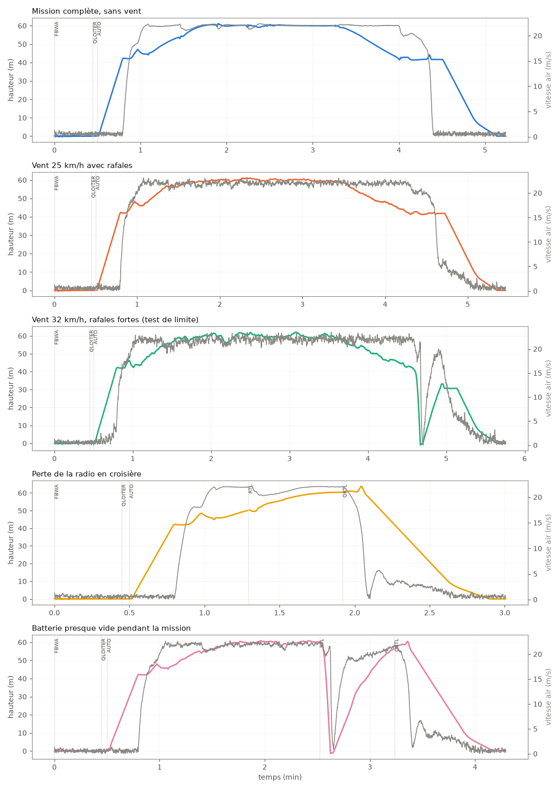
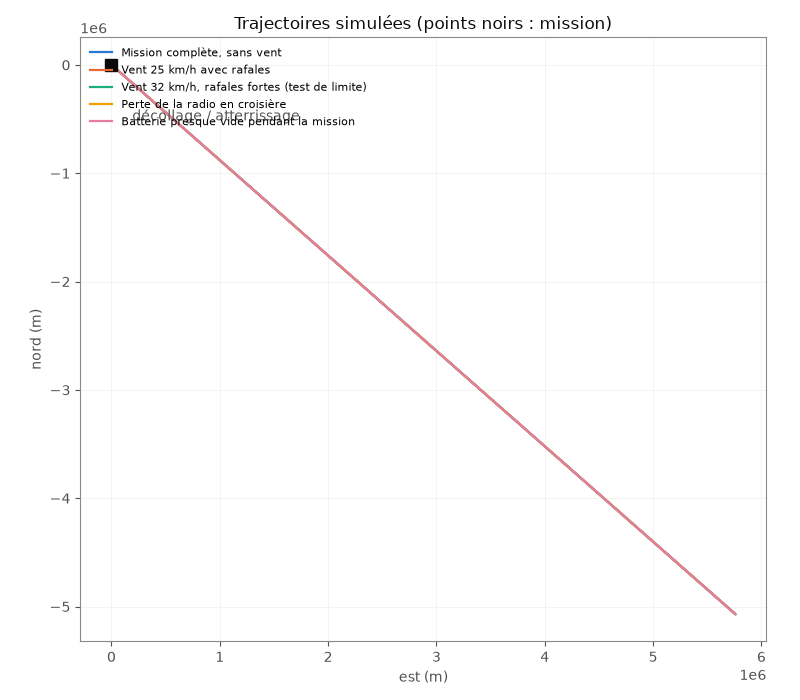

# Vols simulés — Huard DFR

Généré par `simulation/vol_simule.py`. Le **vrai logiciel ArduPilot** (ArduPlane, compilé pour ordinateur : SITL) pilote un modèle de l'avion calculé à partir de nos cotes (`simulation/modele_sitl.py` : masse, aérodynamique, stabilité, moteurs, batterie), avec les paramètres de `ardupilot/huard_*.param`. Seules les sorties de la carte sont remappées sur celles du simulateur.

Modèle : 4.89 kg, marge statique 22%, gaz de stationnaire 72% (estimation du bilan, batterie affaissée), moteur propulsif 25 N au point fixe (nulle à 115 km/h, vitesse de pas de l'hélice).

## Résultats

| Scénario | Résultat | Durée | Croisière (air) | Vitesse mini en avion | Roulis max en avion | Gaz VTOL en stationnaire | Temps moteurs VTOL à fond | Posé à | Batterie consommée | Tension mini |
|---|---|---:|---:|---:|---:|---:|---:|---:|---:|---:|
| Mission complète, sans vent | ✅ posé | 4.7 min | 79 km/h | 76 km/h | 48° | 60% | 0% | 0.0 m du point prévu | 2268 mAh | 22.6 V |
| Vent 25 km/h avec rafales | ✅ posé | 5.0 min | 79 km/h | 74 km/h | 48° | 67% | 0% | 0.2 m du point prévu | 2240 mAh | 22.6 V |
| Vent 32 km/h, rafales fortes (test de limite) | ✅ posé | 5.3 min | 79 km/h | 69 km/h | 48° | 68% | 0% | 0.5 m du point prévu | 2537 mAh | 20.8 V |
| Perte de la radio en croisière | ✅ posé | 2.5 min | 79 km/h | 67 km/h | 48° | 59% | 0% | 0.1 m du point prévu | 1230 mAh | 22.5 V |
| Batterie presque vide pendant la mission | ✅ posé | 3.8 min | 78 km/h | n.d. | 49° | 71% | 0% | 0.1 m du point prévu | 2130 mAh | 17.7 V |

## Paramètres ArduPilot

Tous les paramètres de `ardupilot/huard_*.param` existent dans la version d'ArduPlane simulée et ont été acceptés.

## Déroulement (messages de l'autopilote)

### Mission complète, sans vent

-    30 s : Mission: 1 VTOLTakeoff
-    47 s : Mission: 2 WP
-    47 s : Transition started airspeed 0.2
-    53 s : Transition airspeed reached 16.1
-    58 s : Transition done
-    64 s : Reached waypoint #2 dist 29m
-    64 s : Mission: 3 WP
-    86 s : Reached waypoint #3 dist 43m
-    86 s : Mission: 4 WP
-   112 s : Reached waypoint #4 dist 73m
-   112 s : Mission: 5 WP
-   133 s : Reached waypoint #5 dist 71m
-   133 s : Mission: 6 LoitTurns
-   195 s : Mission: 7 WP
-   239 s : Reached waypoint #7 dist 72m
-   239 s : Mission: 8 VTOLLand
-   239 s : VTOL approach d=343.6
-   255 s : VTOL airbrake v=19.4 d=131 sd=132 h=41.6
-   259 s : VTOL position1 v=17.4 d=54.0 h=41.8 dc=14.5
-   262 s : VTOL position2 started v=9.0 d=9.5 h=42.4
-   270 s : Land descend started
-   296 s : Land final started
-   314 s : Land complete

### Vent 25 km/h avec rafales

-    30 s : Mission: 1 VTOLTakeoff
-    47 s : Mission: 2 WP
-    47 s : Transition started airspeed 0.7
-    53 s : Transition airspeed reached 16.4
-    58 s : Transition done
-    63 s : Reached waypoint #2 dist 31m
-    63 s : Mission: 3 WP
-    81 s : Reached waypoint #3 dist 52m
-    81 s : Mission: 4 WP
-   101 s : Reached waypoint #4 dist 90m
-   101 s : Mission: 5 WP
-   126 s : Reached waypoint #5 dist 60m
-   126 s : Mission: 6 LoitTurns
-   196 s : Mission: 7 WP
-   257 s : Reached waypoint #7 dist 56m
-   257 s : Mission: 8 VTOLLand
-   257 s : VTOL approach d=355.4
-   270 s : VTOL airbrake v=21.4 d=157 sd=157 h=41.5
-   275 s : VTOL position1 v=19.0 d=62.9 h=42.1 dc=15.8
-   279 s : VTOL position2 started v=4.5 d=9.9 h=41.8
-   283 s : Land descend started
-   309 s : Land final started
-   327 s : Land complete

### Vent 32 km/h, rafales fortes (test de limite)

-    30 s : Mission: 1 VTOLTakeoff
-    47 s : Mission: 2 WP
-    47 s : Transition started airspeed 2.8
-    52 s : Transition airspeed reached 16.9
-    57 s : Transition done
-    63 s : Reached waypoint #2 dist 31m
-    63 s : Mission: 3 WP
-    80 s : Reached waypoint #3 dist 51m
-    80 s : Mission: 4 WP
-   100 s : Reached waypoint #4 dist 90m
-   100 s : Mission: 5 WP
-   127 s : Reached waypoint #5 dist 57m
-   127 s : Mission: 6 LoitTurns
-   204 s : Mission: 7 WP
-   274 s : Reached waypoint #7 dist 50m
-   274 s : Mission: 8 VTOLLand
-   274 s : VTOL approach d=360.1
-   279 s : Alt assist 12.6m
-   279 s : Transition started airspeed 19.4
-   291 s : Transition airspeed reached 18.1
-   295 s : VTOL position1 v=20.4 d=142 sd=144 h=29.8
-   305 s : VTOL position2 started v=4.7 d=9.8 h=30.6
-   308 s : Land descend started
-   327 s : Land final started
-   345 s : Land complete

### Perte de la radio en croisière

- radio coupée à t = 72 s
-    30 s : Mission: 1 VTOLTakeoff
-    47 s : Mission: 2 WP
-    47 s : Transition started airspeed 0.7
-    53 s : Transition airspeed reached 16.1
-    58 s : Transition done
-    62 s : Reached waypoint #2 dist 31m
-    62 s : Mission: 3 WP
-    74 s : Throttle failsafe on
-    74 s : RC Short Failsafe On
-    78 s : RC Long Failsafe On: switched to RTL
-   115 s : VTOL airbrake v=18.1 d=120 sd=82 h=60.3
-   120 s : VTOL position1 v=14.7 d=37.7 h=60.7 dc=12.2
-   123 s : VTOL position2 started v=9.0 d=5.6 h=63.7
-   124 s : Land descend started
-   162 s : Land final started
-   180 s : Land complete
-   180 s : PreArm: Radio failsafe on
-   180 s : PreArm: QRTL mode not armable

### Batterie presque vide pendant la mission

-    30 s : Mission: 1 VTOLTakeoff
-    47 s : Mission: 2 WP
-    47 s : Transition started airspeed 0.3
-    53 s : Transition airspeed reached 16.1
-    58 s : Transition done
-    63 s : Reached waypoint #2 dist 30m
-    63 s : Mission: 3 WP
-    82 s : Reached waypoint #3 dist 49m
-    82 s : Mission: 4 WP
-   103 s : Reached waypoint #4 dist 89m
-   103 s : Mission: 5 WP
-   127 s : Reached waypoint #5 dist 66m
-   127 s : Mission: 6 LoitTurns
-   151 s : Battery 1 is low 20.17V used 1135 mAh
-   157 s : Angle assist r=-30 p=-40
-   157 s : Transition started airspeed 21.2
-   157 s : Alt assist 10.7m
-   169 s : Transition airspeed reached 18.8
-   174 s : Transition done
-   194 s : VTOL airbrake v=17.0 d=119 sd=72 h=56.6
-   199 s : VTOL position1 v=13.9 d=34.3 h=58.7 dc=11.6
-   202 s : VTOL position2 started v=9.0 d=5.5 h=60.3
-   203 s : Land descend started
-   239 s : Land final started
-   257 s : Land complete
-   257 s : PreArm: Battery 1 low capacity failsafe
-   257 s : PreArm: QRTL mode not armable

## Limites de la simulation

- Le modèle aérodynamique est calculé, pas mesuré : il sera recalé avec les logs des vrais vols.
- Le moteur propulsif a une poussée constante (pas de baisse avec la vitesse) ; les capteurs sont parfaits (pas de vibrations). Le Mini vole sans capteur de vitesse, comme en vrai.
- Les réglages (PID) sont ceux d'origine d'ArduPilot ; QAUTOTUNE et AUTOTUNE restent à faire en vrai.
