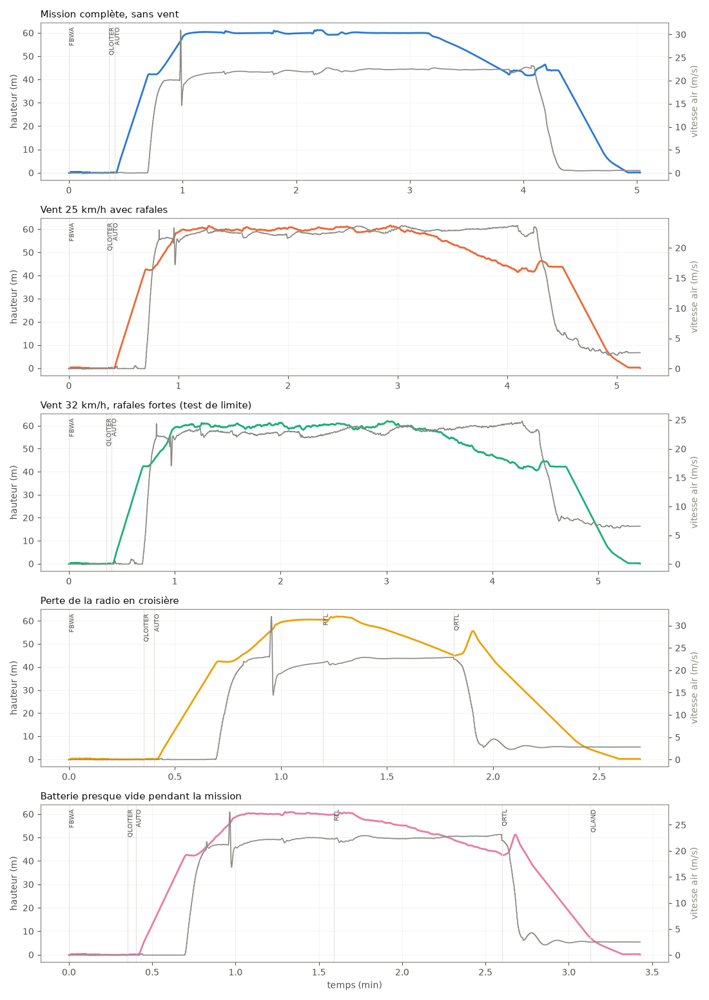
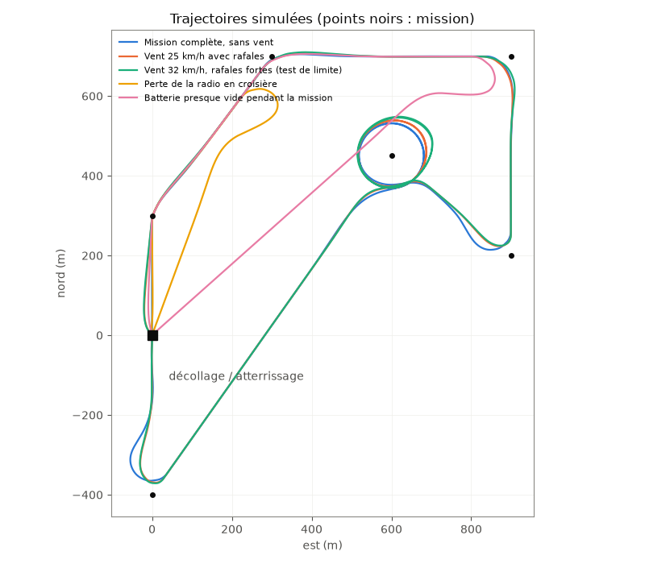

# Vols simulés — Huard Mini

Généré par `simulation/vol_simule.py`. Le **vrai logiciel ArduPilot** (ArduPlane, compilé pour ordinateur : SITL) pilote un modèle de l'avion calculé à partir de nos cotes (`simulation/modele_sitl.py` : masse, aérodynamique, stabilité, moteurs, batterie), avec les paramètres de `ardupilot/huard_*.param`. Seules les sorties de la carte sont remappées sur celles du simulateur.

Modèle : 2.21 kg, marge statique 14%, gaz de stationnaire 66% (estimation du bilan, batterie affaissée), moteur propulsif 13 N au point fixe (nulle à 148 km/h, vitesse de pas de l'hélice).

## Résultats

| Scénario | Résultat | Durée | Croisière (air) | Vitesse mini en avion | Roulis max en avion | Gaz VTOL en stationnaire | Temps moteurs VTOL à fond | Posé à | Batterie consommée | Tension mini |
|---|---|---:|---:|---:|---:|---:|---:|---:|---:|---:|
| Mission complète, sans vent | ✅ posé | 4.6 min | 80 km/h | 53 km/h | 54° | 61% | 0% | 0.1 m du point prévu | 1206 mAh | 15.1 V |
| Vent 25 km/h avec rafales | ✅ posé | 4.8 min | 82 km/h | 62 km/h | 55° | 69% | 0% | 0.3 m du point prévu | 1268 mAh | 15.0 V |
| Vent 32 km/h, rafales fortes (test de limite) | ✅ posé | 5.0 min | 83 km/h | 61 km/h | 55° | 66% | 0% | 0.4 m du point prévu | 1289 mAh | 15.0 V |
| Perte de la radio en croisière | ✅ posé | 2.3 min | 81 km/h | 52 km/h | 54° | 58% | 0% | 0.0 m du point prévu | 744 mAh | 15.5 V |
| Batterie presque vide pendant la mission | ✅ posé | 3.0 min | 81 km/h | 61 km/h | 54° | 71% | 0% | 0.2 m du point prévu | 952 mAh | 12.7 V |

## Paramètres ArduPilot

Paramètres de `ardupilot/huard_*.param` **inconnus** d'ArduPlane (version simulée) : `SERVO_BLH_MASK`, `SERVO_BLH_OTYPE` : ils règlent le DShot de la vraie carte et n'existent pas dans le simulateur. Tous les autres ont été acceptés.

## Déroulement (messages de l'autopilote)

### Mission complète, sans vent

-     0 s : Throttle failsafe off
-    24 s : Mission: 1 VTOLTakeoff
-    41 s : Mission: 2 WP
-    41 s : Transition started airspeed 0.0
-    46 s : Transition airspeed reached 15.3
-    50 s : Transition done
-    58 s : Reached waypoint #2 dist 26m
-    58 s : Mission: 3 WP
-    81 s : Reached waypoint #3 dist 41m
-    81 s : Mission: 4 WP
-   106 s : Reached waypoint #4 dist 72m
-   106 s : Mission: 5 WP
-   128 s : Reached waypoint #5 dist 72m
-   128 s : Mission: 6 LoitTurns
-   188 s : Mission: 7 WP
-   231 s : Reached waypoint #7 dist 74m
-   231 s : Mission: 8 VTOLLand
-   231 s : VTOL approach d=341.8
-   244 s : VTOL airbrake v=22.8 d=174 sd=175 h=41.8
-   245 s : VTOL position1 v=22.7 d=151.1 h=41.9 dc=17.6
-   255 s : VTOL position2 started v=4.7 d=9.8 h=43.9
-   258 s : Land descend started
-   287 s : Land final started
-   301 s : Land complete

### Vent 25 km/h avec rafales

-     0 s : Throttle failsafe off
-    24 s : Mission: 1 VTOLTakeoff
-    41 s : Mission: 2 WP
-    41 s : Transition started airspeed 0.0
-    45 s : Transition airspeed reached 15.3
-    49 s : Transition done
-    56 s : Reached waypoint #2 dist 29m
-    56 s : Mission: 3 WP
-    74 s : Reached waypoint #3 dist 52m
-    74 s : Mission: 4 WP
-    94 s : Reached waypoint #4 dist 88m
-    94 s : Mission: 5 WP
-   118 s : Reached waypoint #5 dist 62m
-   118 s : Mission: 6 LoitTurns
-   186 s : Mission: 7 WP
-   244 s : Reached waypoint #7 dist 57m
-   244 s : Mission: 8 VTOLLand
-   244 s : VTOL approach d=354.3
-   255 s : VTOL airbrake v=25.2 d=207 sd=209 h=41.8
-   256 s : VTOL position1 v=24.6 d=182.1 h=42.5 dc=17.6
-   267 s : VTOL position2 started v=4.8 d=9.7 h=43.8
-   270 s : Land descend started
-   299 s : Land final started
-   312 s : Land complete

### Vent 32 km/h, rafales fortes (test de limite)

-     0 s : Throttle failsafe off
-    24 s : Mission: 1 VTOLTakeoff
-    41 s : Mission: 2 WP
-    41 s : Transition started airspeed 0.0
-    46 s : Transition airspeed reached 15.4
-    50 s : Transition done
-    56 s : Reached waypoint #2 dist 30m
-    56 s : Mission: 3 WP
-    73 s : Reached waypoint #3 dist 53m
-    73 s : Mission: 4 WP
-    91 s : Reached waypoint #4 dist 90m
-    91 s : Mission: 5 WP
-   117 s : Reached waypoint #5 dist 59m
-   117 s : Mission: 6 LoitTurns
-   192 s : Mission: 7 WP
-   256 s : Reached waypoint #7 dist 54m
-   256 s : Mission: 8 VTOLLand
-   256 s : VTOL approach d=357.2
-   265 s : VTOL airbrake v=26.7 d=229 sd=231 h=40.7
-   266 s : VTOL position1 v=26.1 d=202.9 h=40.8 dc=17.6
-   278 s : VTOL Overshoot d=10.7 cs=4.2 yerr=60.0
-   278 s : VTOL position2 started v=4.0 d=9.9 h=42.2
-   281 s : Land descend started
-   309 s : Land final started
-   323 s : Land complete

### Perte de la radio en croisière

- radio coupée à t = 67 s
-     0 s : Throttle failsafe off
-    24 s : Mission: 1 VTOLTakeoff
-    41 s : Mission: 2 WP
-    41 s : Transition started airspeed 0.1
-    45 s : Transition airspeed reached 15.6
-    49 s : Transition done
-    56 s : Reached waypoint #2 dist 30m
-    56 s : Mission: 3 WP
-    68 s : Throttle failsafe on
-    68 s : RC Short Failsafe On
-    72 s : RC Long Failsafe On: switched to RTL
-   109 s : VTOL airbrake v=19.2 d=92 sd=92 h=45.1
-   111 s : VTOL position1 v=18.0 d=56.1 h=45.6 dc=15.0
-   114 s : VTOL position2 started v=6.4 d=9.4 h=55.5
-   120 s : Land descend started
-   148 s : Land final started
-   162 s : Land complete
-   162 s : PreArm: Radio failsafe on
-   162 s : PreArm: QRTL mode not armable

### Batterie presque vide pendant la mission

-     0 s : Throttle failsafe off
-    24 s : Mission: 1 VTOLTakeoff
-    41 s : Mission: 2 WP
-    41 s : Transition started airspeed 0.0
-    46 s : Transition airspeed reached 15.2
-    50 s : Transition done
-    57 s : Reached waypoint #2 dist 27m
-    57 s : Mission: 3 WP
-    76 s : Reached waypoint #3 dist 50m
-    76 s : Mission: 4 WP
-    95 s : Battery 1 is low 13.99V used 422 mAh
-   156 s : VTOL airbrake v=18.7 d=87 sd=87 h=42.6
-   158 s : VTOL position1 v=17.8 d=55.7 h=43.1 dc=14.8
-   161 s : VTOL position2 started v=6.1 d=9.7 h=50.8
-   166 s : Land descend started
-   188 s : Battery 1 is critical 12.92V used 844 mAh
-   205 s : Land complete
-   206 s : PreArm: Battery 1 low voltage failsafe
-   206 s : PreArm: QLand mode not armable

## Limites de la simulation

- Le modèle aérodynamique est calculé, pas mesuré : il sera recalé avec les logs des vrais vols.
- Le moteur propulsif a une poussée constante (pas de baisse avec la vitesse) ; les capteurs sont parfaits (pas de vibrations). Le Mini vole sans capteur de vitesse, comme en vrai.
- Les réglages (PID) sont ceux d'origine d'ArduPilot ; QAUTOTUNE et AUTOTUNE restent à faire en vrai.
